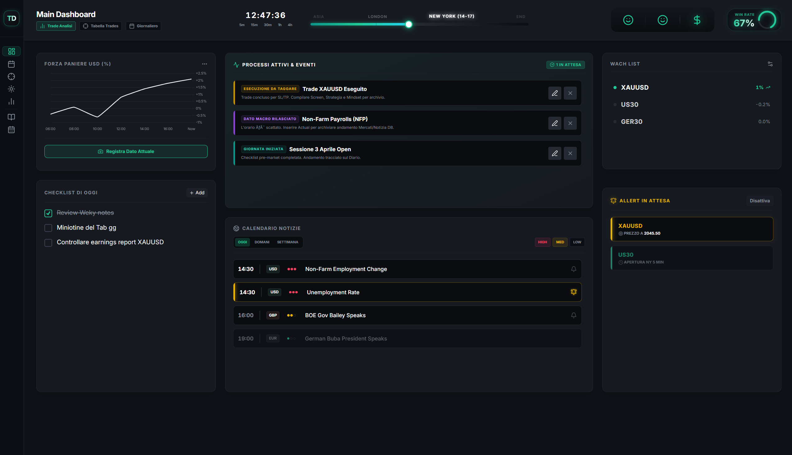
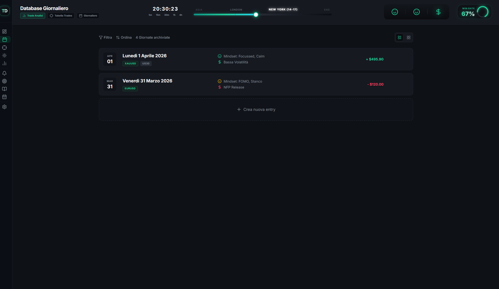

# Trade Desk — Presentazione del progetto

Benvenuto. Questo file ti racconta cos'è il Trade Desk, perché esiste, come è fatto, e in che modo collaborare con il proprietario senza fare danni. Leggilo per intero la prima volta: dopo, il codice avrà molto più senso.

---

## Chi è l'utente e perché esiste questo progetto

Il proprietario è uno **scalper retail con base a Casablanca** (timezone Africa/Casablanca, UTC+1, niente ora legale). Lavora principalmente sulle sessioni di **Londra e New York**, con asset preferiti **XAU/USD, US30, NASDAQ, GER40** e in subordine **EUR/USD, USD/JPY**. La sua giornata operativa è scandita da regole di rischio precise: massimo 2-3 stop loss per sessione, 0.5% di perdita massima per sessione, 0.75-1% rischio massimo giornaliero.

Il Trade Desk è il suo **diario di trading personale**, evoluto in qualcosa di più: una dashboard operativa che lo accompagna **prima**, **durante** e **dopo** ogni sessione. Tre layer convivono nel sistema: la **registrazione manuale** dei trade e degli stati emotivi, le **routine automatiche** che gli mandano ordine del giorno e debrief su Telegram, e un set di **assistenti AI** dedicati (Rodrigo operativo giornaliero e notizie macro, Peter per la disciplina, Steve per le strategie) ognuno con personalità e dati a disposizione diversi.

L'obiettivo non è prevedere il mercato — è **mantenere disciplina e processo costanti**, vedere dove si rompono, e correggere prima che diventino abitudini.

---

## Lo stack in due righe

**Frontend**: HTML + Tailwind CSS (CDN) + Lucide icons + Chart.js + Vanilla JS, una pagina = un file `.html` che importa `supabase-config.js`, `settings.js`, `auth.js` e poi un blocco `<script>` inline. **Niente framework**, niente build step. Il vantaggio è la velocità di prototipazione, lo svantaggio è la duplicazione dell'header/sidebar in ogni pagina.

**Backend**: **Supabase** per tutto — Postgres come database, Auth per il login, Storage per gli screenshot (`trade-screenshots` bucket), Edge Functions Deno per le chiamate AI e i job schedulati. **Anthropic Claude** è il modello dietro tutti gli assistenti (vedi `chat-ai` edge function). **Telegram Bot API** è il canale di notifica preferito.

**Automazione**: oggi alcune routine girano via **PowerShell + Task Scheduler locale** (in `scripts/`), ma sono considerate **tech debt da migrare al cloud** — l'utente non vuole dipendere dall'uptime del proprio PC. Le nuove routine si scrivono come Supabase Edge Functions schedulate con `pg_cron`.

---

## Le pagine, raccontate

Dal **sidebar** sinistro si accede a tutto. La sidebar è collassata di default (16px) e si espande in hover. Le pagine sono divise in tre blocchi logici separati da divider:

### Blocco 1 — Operatività quotidiana

**Dashboard** (`index.html`) è la home. Mostra l'orologio digitale, una timeline con i blocchi di sessione (Asia, London, NY) e un cursore live sulla posizione temporale corrente, le KPI principali (Net P/L, Win Rate, R:R, Drawdown), un mini-grafico di equity, una lista di "processi attivi" (trade aperti, news da validare, allert prezzo). È la prima cosa che apre la mattina e l'ultima alla sera.

**Giornaliero** (`giornaliero.html`) è l'archivio delle giornate. Ogni card è una giornata di trading con data, numero trade, P/L, mood. Click → `dettaglio_giornata.html` per editare mindset/volatilità/note/checklist. La tabella dietro è `giornate`.

**Tab Trade** (`tabella_trades.html`) è il registro piatto di **tutti** i trade, ordinati per data desc. Colonne: ID, Asset, Direzione, Size, Sorgente (badge MT4/Bybit/manuale), Stato, Data/Ora, P/L colorato. Click sulla riga → `dettaglio_trade.html`.

**Cronache** (`cronache.html`) è il recap macro/price-action giornaliero per coin. Filtri per asset (XAUUSD, US30, GER30, NAS100, BTCUSD), grid 5 colonne (lun-ven) con card 16:9 contenenti screenshot del grafico, percentuale del giorno, sentiment, commento. La struttura è in `cronache.coin_data` (JSONB con sotto-oggetti per coin).

**Weekly** (`settimanale.html`) raggruppa le giornate in settimane lavorative (lun-ven). Card con numero settimana, range date, win rate, net profit, badge "corrente".

### Blocco 2 — Sessioni, bias, eventi

**Sessioni** (`sessioni.html`) è l'archivio delle sessioni Asia/London/NY. Ogni sessione ha asset operato, bias, range pips, P/L, mood, e un blocco `coin_data` JSONB con dati per coin (high/low di sessione, screenshot, ecc.).

**Reperti** (`bias.html`) — qui si chiamano "Reperti" nel sidebar ma la tabella è `bias`. Sono le **memorie psicologiche e di mercato**: bias direzionali (LONG/SHORT) su un asset in una data, con confluenze, esito (corretto/sbagliato/parziale), commento, screenshot. Servono a riconoscere pattern ricorrenti del proprio modo di leggere il mercato.

**Eventi** (`allert.html`) — la pagina **più importante per il sistema notizie**, vedi sezione dedicata sotto. Tre tab: Calendario news, Allert prezzo (crypto/coin con alert preimpostati), MonitoraSmile (registro stato emotivo + volatilità).

### Blocco 3 — Analisi, strategie, AI

**Analisi** (`analisi.html`) è la dashboard statistica completa. Filtri per periodo e broker, 4 KPI grandi (Net P/L, Win Rate, R:R, Max Drawdown), equity curve, pie chart P/L per asset, bar chart P/L per sessione.

**Strategie** (`strategie.html`) è l'hub dei playbook meccanici. Card per strategia con nome, ipotesi, target icon, status, win rate, numero trade, R:R medio. Click → `dettaglio_strategia.html` per editare regole di ingresso (JSONB), gestione rischio, screenshot esempio.

**Grafici** (`grafici.html`) è un embed TradingView con tab per coin e un workflow per Ctrl+V degli screenshot dal grafico verso una destinazione (trade, bias, cronaca, sessione). Lo screenshot finisce in Supabase Storage e l'URL viene scritto nel record di destinazione.

**Peter** (`dede.html`) e **Steve** (`steve.html`) — pagine chat dedicate. **Rodrigo** non ha pagina propria ma vive nel **widget chat floating** in `app.js` (presente in tutte le pagine tranne dede/steve/login) e nelle routine. **`assistente.html`** è la chat con due tab: "Coach" (Peter) e "Power" (Steve). Vedi sezione assistenti.

**Impostazioni** (`impostazioni.html`) — checklist di disciplina (drag-reorder), blocchi timeline personalizzabili, frasi motivazionali. Tutto in `user_settings` con chiavi `td_checklist`, `td_timeline_blocks`, `td_frasi_disciplina`.

### Pagine di dettaglio

Ogni entità ha un suo `dettaglio_*.html` con il pattern: URL param `?id=...` → form di edit → bottoni Salva / Cancella. Sono `dettaglio_trade`, `dettaglio_giornata`, `dettaglio_settimana`, `dettaglio_sessione`, `dettaglio_strategia`, `dettaglio_bias`, `dettaglio_allert`, `dettaglio_cronaca`.

---

## Gli assistenti AI: chi sono e cosa fanno

Tutti gli assistenti vivono dietro la stessa edge function — `chat-ai` in `supabase/functions/chat-ai/`. La function riceve `{message, history, mode}`, carica contesto dal DB in base al `mode`, e chiama Anthropic Claude (`claude-sonnet-4-6`). Le tre identità sono distinte solo via system prompt e dati esposti. Frontend chiamate: `dede.html` usa `mode='coach'`, `steve.html` usa `mode='power'`, il widget floating in `app.js` e `assistente.html` Coach/Power usano i mode rispettivi. Default fallback: `giornaliero` → Rodrigo.

**Rodrigo** (mode `giornaliero`, vive nel widget floating in `app.js` e nelle routine PowerShell + edge function notizie) è l'**assistente operativo giornaliero**. Risposte cortissime (3-4 righe), tono pratico, sveglio, può bacchettare in modo professionale, mai motivational speech. Ricorda, compila su richiesta, sintetizza. Nudge brevi, promemoria mirati, riepiloghi operativi. Ha accesso solo ai trade di oggi, giornata corrente, MonitoraSmile recenti, sessioni di oggi, bias recenti. Quando l'utente dice "ho fatto un trade su XAU long", compila da solo via `db_actions` JSON. **Non ha accesso alla tabella `watchlist`**.

**Peter** (mode `coach`, pagina `dede.html` — il file si chiama dede per ragioni storiche, il personaggio è Peter) è l'**analista comportamentale clinico**. **Non è un coach motivazionale da palestra**, è un analista obiettivo distaccato. Lavora sul processo decisionale, non sui risultati. Identifica errori cognitivi (FOMO, revenge, overconfidence, forcing), trova il primo momento di deviazione, dà voto 0-10 su disciplina (non PnL). **Regola critica**: non presumere pattern — quando ne segnala uno, dichiara sempre il livello di confidenza statistica ("n=4, debole" / "n=23, robusto"). Accesso a 30gg di trade, giornate, bias, strategie.

**Steve** (mode `power`, pagina `steve.html`) è il **calcolatore strategico**, usato raramente per analisi quantitative profonde e lavoro su strategie. Numerico, conciso, zero fronzoli. Risposte con tabelle, sezioni chiare, dimensione del campione sempre dichiarata. Accesso completo allo storico (150 trade, cronache, settimane, giornate, strategie).

---

## Il sistema notizie macro: come funziona

È la parte **più recentemente ricostruita** del sistema. Il flusso è interamente cloud, niente PC dell'utente coinvolto.

**Lunedì alle 05:30 Casablanca** parte un cron job (`pg_cron`) che invoca la edge function `news-weekly-fetch`. La function scarica il calendario settimanale da `https://nfs.faireconomy.media/ff_calendar_thisweek.json`, filtra solo gli eventi a impatto **alto/medio** delle valute **USD ed EUR**, e per ognuno:
1. Verifica con `ff_id` se è già in tabella (dedup).
2. Chiama Claude in stile Rodrigo per generare l'**analisi pre-evento** ("cos'è il dato, quanto influenza i mercati, scenari sopra/sotto attese").
3. Inserisce la riga nella tabella `allert` con `note` popolato dall'analisi.

**Cinque minuti prima dell'orario di ogni evento**, un altro cron (`*/5 * * * *`) invoca `news-reminder`. La function trova gli eventi imminenti non ancora compilati e manda un messaggio Telegram firmato Rodrigo che ricorda di compilare l'attuale dopo l'uscita.

**Quando l'utente apre il modale dalla pagina Eventi e scrive il valore effettivo**, lo `UPDATE` su `allert.valore_effettivo` fa scattare un **trigger Postgres** (`allert_trigger_rodrigo_comment_tr`) che invoca asincronamente `news-actual-fetch` via `pg_net`. La function legge la riga, chiama Claude in stile Rodrigo per il **commento post-uscita** ("il dato è sopra/sotto attese, cosa significa per USD/oro/indici, direzione attesa"), e scrive in `commento_rodrigo`. Tornando sul modale lo trovi compilato.

Le tabelle e le colonne chiave: `allert.ff_id` (UNIQUE, dedup ForexFactory), `allert.note` (analisi pre), `allert.commento_rodrigo` (analisi post), `allert.reminder_sent` (BOOL, dedup notifiche Telegram), `allert.valore_atteso/precedente/effettivo`, `allert.impatto` (`alto`/`medio`/`basso`), `allert.data_evento` (DATE), `allert.ora_evento` (TIME, **in fuso Casablanca**).

**Limitazione nota**: il JSON ForexFactory che usiamo **non contiene il valore effettivo** — è solo calendario forward. Per questo l'utente compila l'attuale a mano dal modale. Per automatizzarlo del tutto serve scraping HTML (fase 2 non ancora prioritaria).

---

## Le routine Telegram: chi parla quando

Le routine sono i **messaggi pianificati** che arrivano sul Telegram dell'utente nei momenti critici della giornata. Oggi alcune sono PowerShell (in `scripts/`), altre sono già edge function Supabase. La direzione è migrare tutto su cloud.

**07:00 Casablanca — `ordine-del-giorno.ps1`** raccoglie macro del giorno, bias aperti da rivalutare, ultimi 5 trade, forza USD calcolata sui movimenti DXY. Salva in `giornate.ordine_del_giorno` (JSONB) e manda Telegram con header "Ordine del Giorno".

**07:30 Casablanca — `routine-rodrigo-morning.ps1`** legge stato giornata, checklist, ordine del giorno, reperti, allert ad alto impatto del giorno, e produce un messaggio operativo firmato Rodrigo.

**11:15 e 16:45 Casablanca — `routine-peter-session-debrief.ps1`** debrief di fine sessione (Londra alle 11:15, NY alle 16:45). Conta trade, calcola win rate di sessione, P/L, dà un voto disciplina. Firmato Peter.

**17:15 Casablanca — `routine-peter-eod.ps1`** digest completo di fine giornata: metriche, confronto vs baseline 30gg, voto, una sola regola per domani. Firmato Peter.

**21:00 Casablanca — `routine-rodrigo-domani.ps1`** preparazione del giorno dopo: calendario news USD/EUR, bias ancora aperti.

Ogni esecuzione viene loggata in `routine_events` con `slot`, `tipo`, `payload`, `telegram_sent`, `telegram_message_id`. I messaggi Claude vengono salvati in `assistant_messages` per poterli rileggere.

---

## Le tabelle principali del database

`trades` è il cuore — ogni riga è un'operazione. Collegata a `giornate`, `sessioni`, `strategie` via FK opzionali. Contiene entry/exit/SL/TP, P/L, pips, R:R teorico e reale, screenshot URL, mood, candle context (m15/h1/h4/d1), regole rispettate (JSONB checklist).

`giornate` è una riga per data, stato emotivo, mercato, volatilità, P/L aggregato, n_trades, win rate, ordine_del_giorno JSONB.

`sessioni` è una riga per ogni sessione operata (Asia/London/NY in una data), con `coin_data` JSONB che contiene i dati per coin (high/low/screenshot/sentiment).

`bias` sono le memorie direzionali su un asset/data con commento e screenshot.

`allert` sono gli eventi macro dal calendario ForexFactory (vedi sezione notizie).

`allert_prezzo` sono gli alert prezzo crypto/coin generati esternamente, con commento utente.

`monitora_smile` è il registro fine dello stato emotivo + volatilità nel tempo (sorgente: bottoni interattivi nell'header dell'app, salvataggi schedulati).

`cronache` sono i recap macro/price-action giornalieri per coin.

`strategie` sono i playbook meccanici con regole di ingresso JSONB.

`routine_events`, `assistant_messages`, `articoli_daily`, `cronache_auto`, `forza_usd`, `watchlist`, `user_settings` sono tabelle di supporto.

Lo schema completo iniziale è in `supabase_schema.sql` ma è **datato** — il DB attuale ha molte più colonne. Per la verità più aggiornata leggi le tabelle direttamente da Supabase.

---

## Convenzioni e regole di lavoro

**Timezone**: tutto è in **Africa/Casablanca** (UTC+1, niente DST). Ore nei record DB, ore mostrate in UI, scheduling cron (calcolare in UTC: `casa_hour - 1`). Mai usare Europe/Rome o UTC nella UI.

**Lingua**: tutto in italiano — UI, prompt assistenti, commenti dei messaggi Telegram. Mai parolacce in nessun output AI.

**Modello Claude**: usa il più recente disponibile (oggi `claude-sonnet-4-6`). Per task semplici/economici si può scendere a Haiku 4.5.

**Secrets**: stanno in `scripts/routine.secrets.ps1` (gitignored) per le routine PowerShell, e in env var Supabase (Project Settings → Edge Functions → Manage secrets) per le edge function. I nomi standard sono `ANTHROPIC_API_KEYS`, `TELEGRAM_BOT_TOKEN`, `TELEGRAM_CHAT_ID`, `SUPABASE_SERVICE_ROLE_KEY`, `SUPABASE_URL`.

**Commit**: si committa solo a fine giornata, in batch, e solo quando l'utente lo dice esplicitamente. Niente commit durante il lavoro.

**Architettura cloud-first**: ogni soluzione che richiede il PC dell'utente acceso è considerata tech debt. Le routine PowerShell esistenti vanno migrate progressivamente. VPS è ultima scelta. Il target è Supabase + Anthropic + GitHub Actions.

**Frontend**: niente framework, niente build step. Modificare le pagine direttamente, importare gli script via `<script src=...>` da CDN. La sidebar è duplicata in ogni file (non è un vero include).

---

## Come muoversi nel codice

`app.js` è l'engine condiviso che fa girare l'header dinamico di tutte le pagine: orologio, timeline, win rate ring, MonitoraSmile, badge timeframe che lampeggiano negli ultimi secondi prima della chiusura barra.

`supabase-config.js` istanzia il client Supabase globale come `db`.

`auth.js` controlla la sessione JWT e redirect a `login.html` se scaduta.

`settings.js` carica le impostazioni utente (checklist, timeline blocks, frasi disciplina) in localStorage.

`DOCUMENTAZIONE.md` (in root) è una documentazione più tecnica e dettagliata, **complementare** a questa presentazione. Leggila quando serve guardare un componente specifico nel dettaglio.

`supabase/functions/` contiene le edge function. Ogni cartella ha un suo `index.ts` Deno standalone. Per deploy si usa MCP Supabase o `supabase functions deploy <name>` da CLI.

---

## Cosa NON fare

Non aggiungere framework JS, build tool, package manager (no npm install, no webpack, no React).

Non rimuovere il filtro USD/EUR dalla `news-weekly-fetch` senza chiedere — è una scelta esplicita per ridurre rumore.

Non modificare lo schema `allert` senza una migration documentata; ci sono trigger e cron che dipendono dalle colonne esistenti.

Non scrivere nei prompt degli assistenti niente che possa suonare come **coach motivazionale da palestra** — Peter è un **analista**, non un Mr. Miyagi. Niente frasi tipo "credi in te stesso". Anche per Sofi e Rodrigo: tono asciutto, operativo.

Non usare Europe/Rome o UTC come timezone di default.

Non fare commit a metà giornata. Niente push senza richiesta esplicita.

Non lasciare console.log dimenticati in produzione, ma in fase dev sono benvenuti.

---

## Il prossimo passo tipico di una sessione

L'utente apre la dashboard, dà un'occhiata all'ordine del giorno che Rodrigo ha mandato la mattina, controlla i bias aperti, segna lo stato emotivo iniziale, opera, riceve i debrief di sessione di Peter, valida le notizie macro che escono compilando l'attuale (Rodrigo genera il commento), chiude la giornata con il digest EOD di Peter, e la sera Rodrigo gli ricorda cosa lo aspetta domani.

Tu, Claude, sei il **collaboratore di sviluppo** che lo aiuta a far evolvere questo sistema. Quando ti chiede qualcosa, prima capisci dove si inserisce nel flusso descritto sopra, e poi proponi la soluzione — facendo le domande giuste invece di andare a colpo sicuro.

Buon lavoro.
